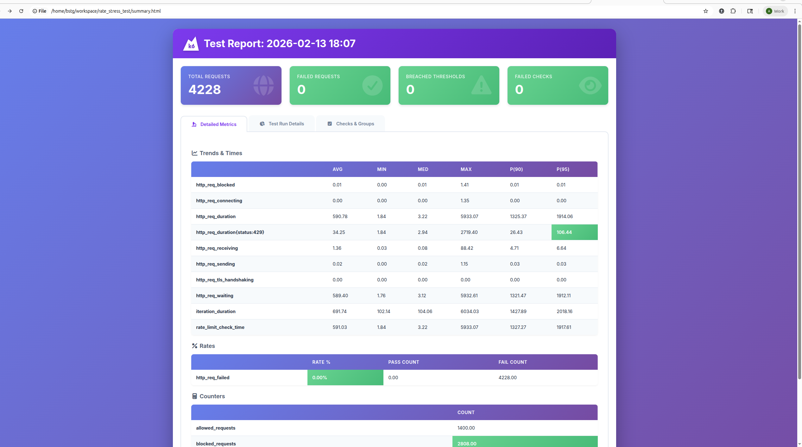
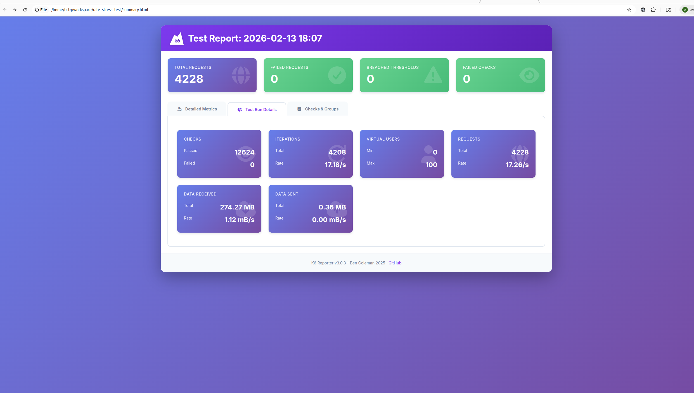
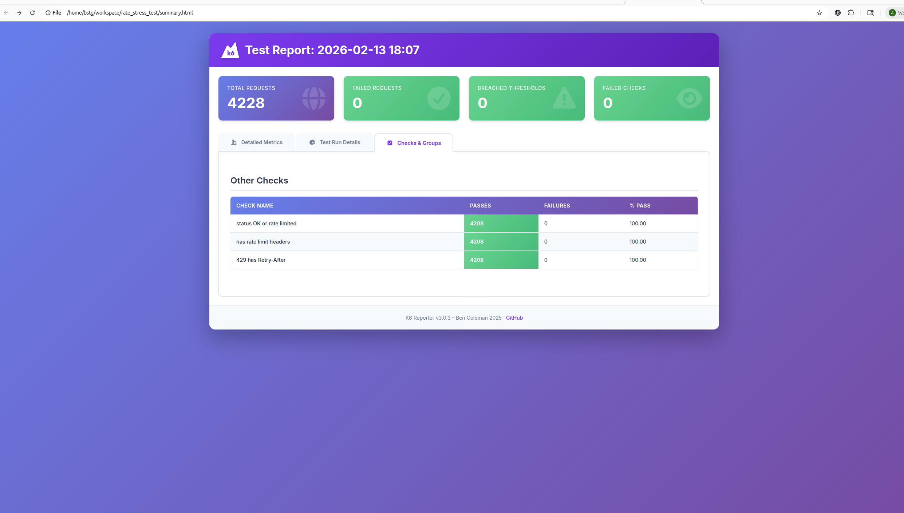
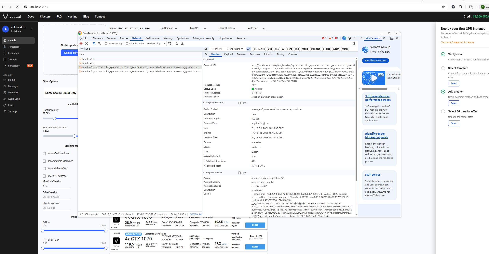

## Running locally

First ensure you have the vast webserver running 

```bash
k6 run main.js
```

This generates the k6 summary in terminal output and writes `summary.html`.

### k6 report output







### Frontend headers check

If you run the VAST frontend locally, you should see the rate-limit headers rendered correctly.

